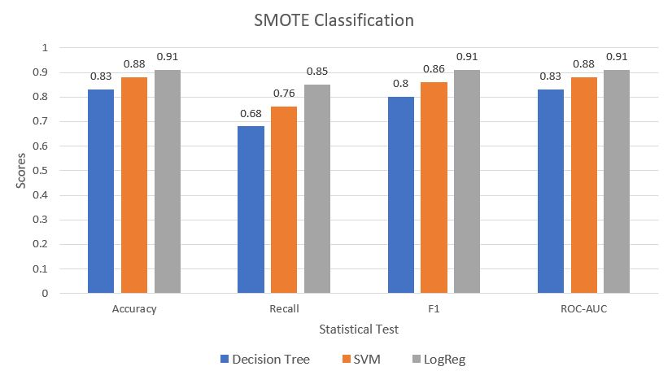

# Fraud Detection with Auto ML Overview

Fraud detection is a common issue for any company that issues credit or loans. Detecting these instances of fraud has the potential to save the company millions in addition to improving its image and reliability among stakeholders and customers. Therefore, it is often an exemplar case study for students new to data science, allowing them to test multiple classifier algorithms for statistical scores like accuracy, recall, or F1. 

This particular investigation will demonstrate how to automatically build models with AutoML using H2O's AutoML package. While time intensive, this can be an extremely efficient way of generating effective models.

## Table of Contents

**Fraud Detection with AutoML** - Jupyter notebook OSEMN walkthrough of cleaning the data and feeding it to AutoML systems. 

**sample_1.csv** - data of credit card activity containing 30000 entries, which is a subset of the original*

**fraud_csv** - dataset containing only fraudulent transactions used to balance target groups and compared with oersampling and also used as a test set.

*for full data set, please visit this [link](https://www.kaggle.com/mlg-ulb/creditcardfraud)

## Methodology

1. Extract 30000 entries as a training set
2. Label data and balanced classes with remaining data
3. Create a test set for final scoring with remaining data
4. Run AutoML to create best model
5. Create Random Forest and SVM models for comparison
6. Predict and score based on accuracy, recall, and F1

## Results

### SMOTE Classification Results

### Balanced Class Parameter Results

With the exception of decision tree, using the *balanced* class parameter for each algorithm allowed it to perform a little bit better than with SMOTE. Therefore,
we'll compare the best model from AutoML against each of the algorithms built. H2O's AutoML also has a parameter for this, so that will be utilized instead of the SMOTE data. 

### AutoML Results

H2O's AutoML package is pretty versatile in what is customizable. For the stopping metric, AUCPR was selected due to the class imbalanced, and only 10 models were run to save time. The results can be seen below compared to the other algorithms.

AutoML did not perform as well as expected. While accuracy was very high, the recall was unacceptable, especially since false negatives can lead to huge financial losses in fraud detection. This is because the model overfitted to the training data, even with balanced weights:

## Conclusion

AutoML is extremely convenient in being able to create multiple models for both regression and classification problems. However, it is unlikely to replace data scientists (yet) as it is computationally expensive and requires a lot of hyperparameter tuning from the user. This could be somewhat mitigated through hyperparameter optimization, but that would still require more time and resources, especially for operations of scale. 
